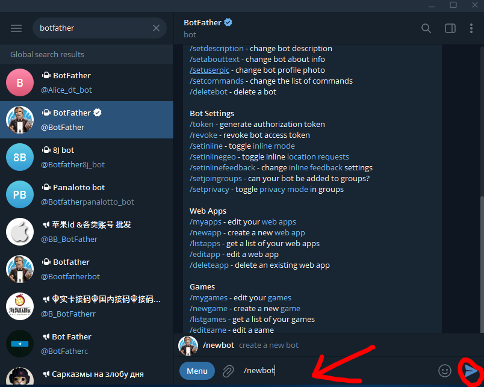
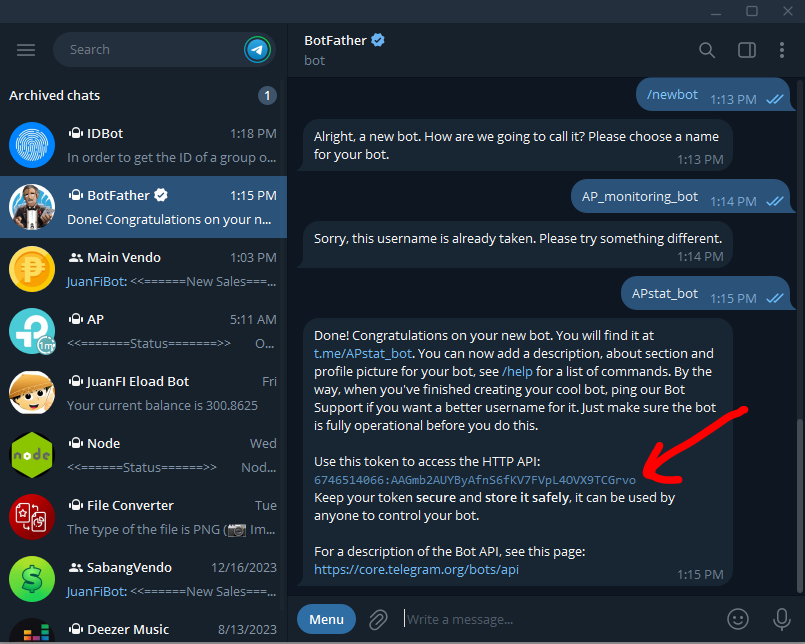

# Create a Telegram bot to monitor your APs 

## 1.) Search for BotFather and click Start

  

## 2.) Enter "/newbot" to create a new bot

  

## 3.) Name your own bot

  

> After naming your bot it will give out the token 

# DONE!
